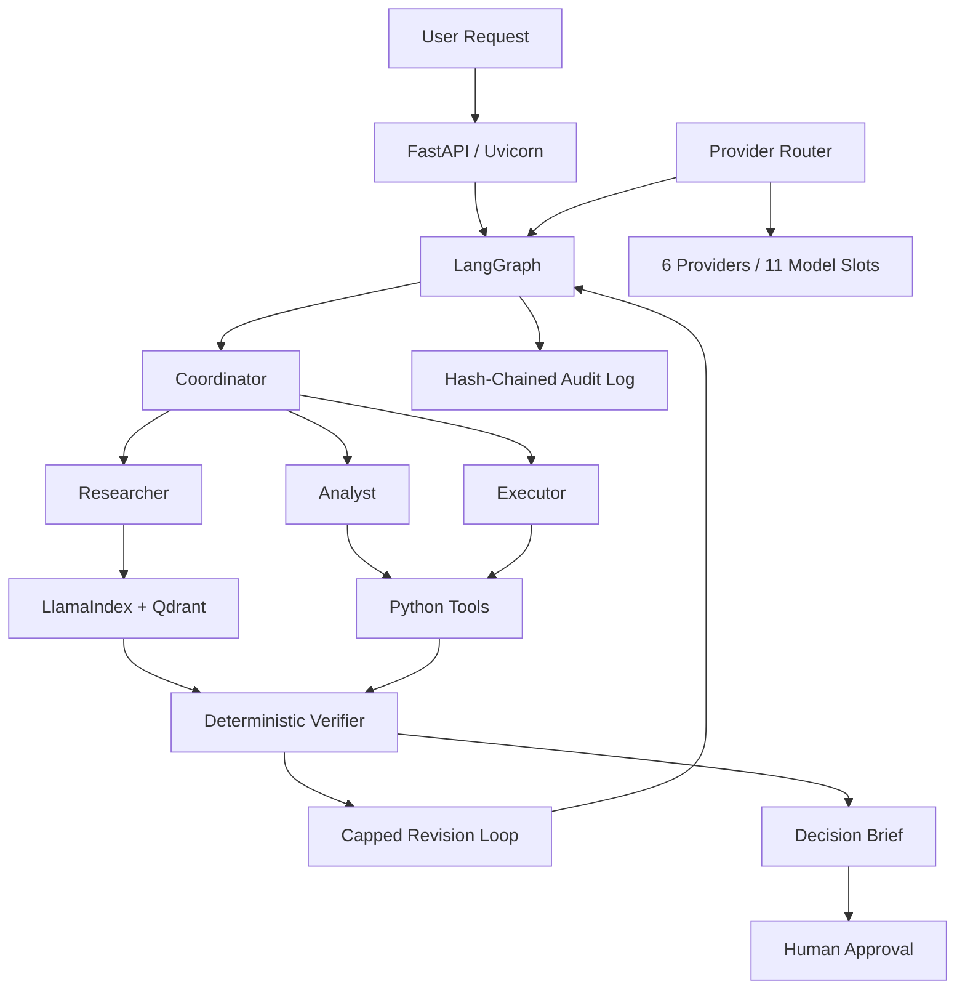
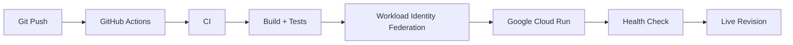

```markdown
---
title: Automatron

colorFrom: indigo

sdk: docker
app_port: 7860
pinned: false
license: mit
short_description: Multi-agent decision support for space, quant, e-commerce and real estate
---

# Automatron

### Multi-agent decision support for high-stakes workflows

Automatron is a multi-agent system that helps structure complex decisions across four domains:

**Space Operations · Quantitative Finance · E-commerce · Real Estate**

Instead of sending a request directly to an LLM, Automatron breaks the task into specialised steps, gathers evidence, runs deterministic analysis, verifies the result, and stops at a human approval gate.

> **The system prepares the decision. A human makes it.**

---

## How it works

```text
                         USER REQUEST
                              |
                              v
                       +--------------+
                       |  COORDINATOR |
                       | Plans the    |
                       | workflow     |
                       +------+-------+
                              |
                +-------------+-------------+
                |             |             |
                v             v             v
           RESEARCHER      ANALYST      EXECUTOR
                |             |             |
                +-------------+-------------+
                              |
                              v
                   +----------------------+
                   | Python / Tools       |
                   | Deterministic work  |
                   +----------+-----------+
                              |
                              v
                   +----------------------+
                   |     VERIFIER         |
                   | Evidence + numbers   |
                   +----------+-----------+
                              |
                       +------+------+
                       |             |
                    Revision        Pass
                       |             |
                       +------<------+
                              |
                              v
                     DECISION BRIEF
                              |
                              v
                    HUMAN APPROVAL
```

The important distinction is that the LLM is used for flexible reasoning, while important calculations and validation are handled deterministically.

---

## What it can do

Automatron currently contains **4 sectors and 12 workflows**.

| Sector | Workflows |
|---|---|
| **Space** | Conjunction triage, anomaly root cause, licensing and spectrum |
| **Quant** | Alpha audit, trade approval, trading-code compliance |
| **E-commerce** | Return dispute, chargeback representment, seller appeal |
| **Real Estate** | Due-diligence red flags, permit pre-screen, dispute summary |

All bundled scenarios use synthetic data and fictional organisations and jurisdictions.

---

## Two principles

### 1. Numbers come from tools

The model is not trusted to invent quantitative results in free-form text.

If a decision brief contains a number that was not produced by a deterministic tool, verification fails and the workflow is sent back for revision.

```text
Model reasoning
      |
      v
Tool execution
      |
      v
Deterministic result
      |
      v
Verification
```

### 2. Recommendations are not decisions

Automatron can research, analyse, calculate, identify risks and prepare recommendations.

It does not:

- Place orders
- Execute trades
- File documents
- Approve permits
- Take regulatory actions
- Make the final decision

The final decision remains with a qualified human.

---

# Architecture



### Core components

| Component | Purpose |
|---|---|
| **LangGraph** | Agent orchestration and workflow state |
| **LlamaIndex** | Retrieval pipeline |
| **Qdrant** | Vector storage |
| **Python tools** | Deterministic calculations |
| **Provider router** | Model selection and failover |
| **Verifier** | Deterministic validation |
| **Audit log** | Hash-chained decision history |
| **FastAPI** | API layer |
| **Cloud Run** | Production deployment |

---

# Agent roles

Automatron does not give every agent unrestricted access.

### Coordinator
Plans the workflow and dispatches tasks.

### Researcher
Retrieves relevant sector knowledge and supporting evidence.

### Analyst
Performs quantitative and sector-specific analysis using deterministic tools.

### Executor
Runs permitted tools and produces structured outputs.

Each role operates under a tool allowlist enforced in code.

---

# Retrieval

The retrieval layer uses **LlamaIndex + Qdrant** with dense and sparse retrieval.

```text
                    Request
                       |
                       v
                Retrieval Layer
                  /          \
                 /            \
                v              v
          Dense Search    Sparse Search
                \              /
                 \            /
                  v          v
                     Qdrant
                       |
                       v
                Relevant Evidence
```

Knowledge is isolated by sector so workflows operate against the appropriate domain context.

---

# Reliability

The project is designed around failure cases as well as the normal execution path.

### Provider failover

The provider router can fail over when providers encounter:

- Rate limits
- Quota exhaustion
- Context overflow

### Idempotent requests

`POST /api/v1/runs` supports an `Idempotency-Key`.

A retry with the same key returns the existing run instead of starting another one.

```text
Request
   |
   +--> First request  --> Start run
   |
   +--> Retry          --> Return existing run
```

### Deterministic verification

Agent output is checked before it reaches the human approval stage.

### Offline testing

The complete workflow can run without API keys using a fake model.

The real tools still execute, allowing the system to be tested without consuming provider quota.

### Auditability

Every decision is recorded in a hash-chained audit log that can be verified.

---

# Cloud deployment

Automatron is containerized and deployed to **Google Cloud Run**.



The deployment uses:

- GitHub Actions
- Google Cloud Run
- Artifact Registry
- Secret Manager
- Workload Identity Federation
- Automated post-deployment smoke tests

No long-lived Google Cloud service-account key is stored in the repository.

Current Cloud Run configuration:

```text
Memory:        2 GiB
CPU:           1
Max instances: 1
Concurrency:   20
Timeout:       900 seconds
```

---

# CI/CD

CI runs on pushes and pull requests and checks:

```text
Lint
  |
Notebook build
  |
Stored-output checks
  |
Offline tests
  |
Container build
```

Deployment runs after CI succeeds:

```text
Push to main
     |
     v
    CI
     |
   Pass
     |
     v
Cloud Run deployment
     |
     v
Health check
     |
     v
Smoke test
     |
     v
Live revision
```

---

# Run locally

Clone the repository:

```bash
git clone https://github.com/Arnavdsp/Automatron.git
cd Automatron
```

Install dependencies:

```bash
pip install -r requirements-dev.txt
```

Build the application modules:

```bash
python scripts/build_notebooks.py
```

Run completely offline:

```bash
AUTOMATRON_FAKE_LLM=1 python app.py
```

Run with real providers:

```bash
python app.py
```

Run tests:

```bash
pytest -q
```

Run evaluation scenarios:

```bash
python tests/eval/run_eval.py
```

The offline mode requires no API keys.

---

# Project structure

```text
Automatron/
|
├── app.py
├── Dockerfile
├── README.md
├── DECISIONS.md
├── requirements.txt
├── requirements-dev.txt
|
├── config/
│   ├── providers.yaml
│   ├── sectors.yaml
│   └── rules/
|
├── data/
│   ├── knowledge/
│   └── samples/
|
├── notebooks/
│   ├── automatron_core.ipynb
│   ├── automatron_ecommerce.ipynb
│   ├── automatron_quant.ipynb
│   ├── automatron_realestate.ipynb
│   └── automatron_space.ipynb
|
├── scripts/
│   └── build_notebooks.py
|
├── tests/
│   ├── eval/
│   ├── integration/
│   ├── live/
│   └── unit/
|
└── .github/
    └── workflows/
        ├── ci.yml
        └── deploy.yml
```

---

# Design decisions

The repository contains `DECISIONS.md`, which documents the major architectural choices and the reasoning behind them.

The goal is to document not only **what** was built, but **why** it was built that way.

---

# Evaluation

The project includes:

- Unit tests
- Integration tests
- Golden evaluation scenarios
- Offline fake-model testing
- Deployment smoke tests
- Notebook build checks
- Container build checks

Run the complete offline test suite:

```bash
pytest -q
```

Run evaluation scenarios:

```bash
python tests/eval/run_eval.py
```

---

# Limitations

Automatron is a portfolio and engineering project.

It is not:

- Investment advice
- Legal advice
- Compliance advice
- Engineering advice
- Regulatory advice
- Operational conjunction screening

All bundled data is synthetic.

The sector rules and thresholds are illustrative and would require independent validation before being used in a real production domain.

---

# Current status

```text
Sectors                 4
Workflows              12
Model providers         6
Model slots            11
Retrieval        Dense + Sparse
Verification     Deterministic
Audit             Hash-chained
Deployment        Cloud Run
CI/CD             GitHub Actions
Human approval    Required
```

---

# Future work

Areas I want to explore next:

- Distributed execution
- Persistent distributed idempotency
- More rigorous agent evaluation
- Better observability and tracing
- Cost-aware model routing
- Retrieval evaluation
- Stronger policy verification
- Persistent audit storage

---

# Author

**Arnav Deshpande**

B.Tech, Space Science & Engineering  
IIT Indore

GitHub:  
https://github.com/Arnavdsp

---

## The core idea

```text
LLM reasoning
      |
      v
Tool execution
      |
      v
Deterministic verification
      |
      v
Decision brief
      |
      v
Human decision
```

Automatron is an exploration of how agentic AI systems can be made more structured, verifiable and controllable when the workflow matters as much as the answer.
```
